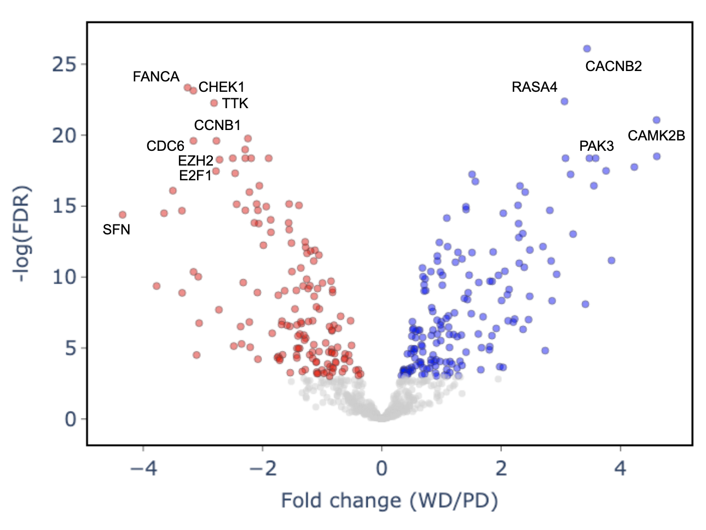

# NET_hist_classifier

Neuroendocrine neoplasms (NEN) arise from the neuronal cells and hormone-producing cells of the neuroendocrine system. NENs are rare, but their incidence has increased 6.4-fold over the last four decades. One of the challenges for this tumor type is to accurately diagnose NEN, identify their histologic subtypes, and infer primary sites in order to properly design a course of treatment. Despite the similar histologic appearance, poorly differentiated (PD) NENs are highly aggressive, with short-lived responses to therapy and shorter life expectancy. To refine the distinction between slow-growing and aggressive NENs, we deployed transcriptome profiling with AI-based modeling of 36 NEN samples, including 12 PD neuroendocrine carcinomas (NEC). Our analyses suggest the third subtype exhibits unique gene expression patterns that are different from PD NEC and WD NET. Based on unbiased machine learning models, our prediction model predicted NEN histological subtypes with 93% accuracy. Our model demonstrated SFN, CHEK1, E2F1, CDC6, and TTK as novel predictive biomarkers for PD NECs, where most of them play a key role in DNA damage checkpoint. Our interactive web-based visualization is publicly available at https://nen-hist-ge.epigenomeocean.org/.

